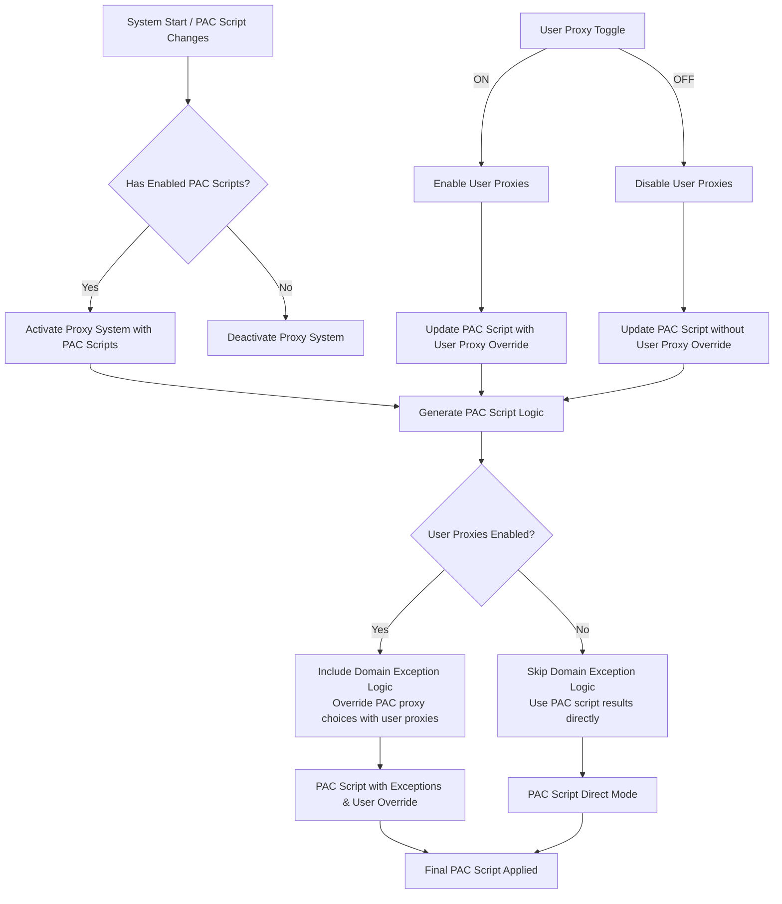
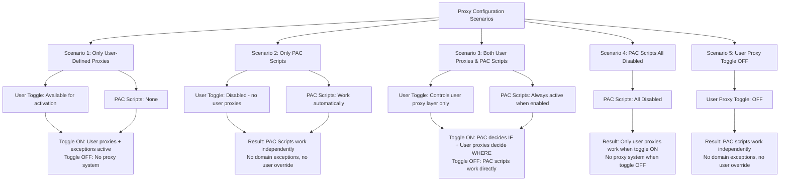
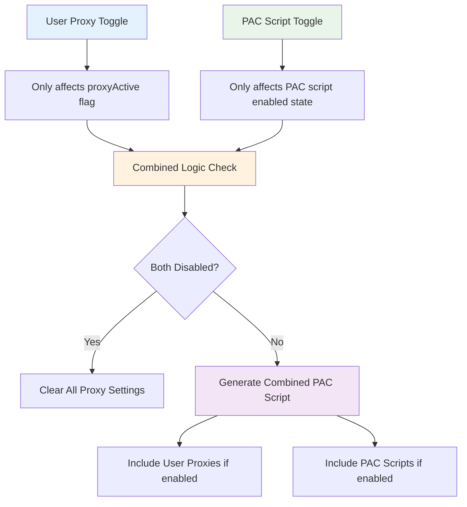

# PAC Proxy Manager Extension

A modern Chrome extension for managing PAC (Proxy Auto Configuration) scripts with an intuitive interface. This extension allows you to configure proxy settings, manage PAC scripts, set domain exceptions, and control proxy servers through a clean, responsive UI.

## 🌟 Features

### Core Functionality
- **PAC Script Management**: Add, edit, and manage multiple PAC scripts from URLs or direct content
- **Domain Exceptions**: Configure domain-specific proxy rules with granular control
- **Proxy Server Configuration**: Set up and manage custom proxy servers
- **Smart Proxy Logic**: Intelligent proxy selection based on domain exceptions and PAC script results

### User Interface
- **Modern Design**: Built with React, Tailwind CSS, and Headless UI components
- **Responsive Layout**: Clean, tabbed interface with skeleton loading states
- **Icon Integration**: Uses Heroicons for consistent iconography
- **Toast Notifications**: Real-time feedback with react-hot-toast

### Technical Features
- **Multi-language Support**: Available in English and Russian
- **IndexedDB Storage**: Efficient local storage for configuration data
- **Manifest V3**: Uses the latest Chrome extension architecture
- **Comprehensive Testing**: Unit tests with Vitest and Testing Library
- **Modern Build System**: Vite-based build process with hot reload

## 📋 Requirements

- Google Chrome or Chromium-based browser
- Chrome Extensions Developer Mode enabled (for development)

## 🚀 Installation

### From Release
1. Download the latest release from the GitHub releases page
2. Extract the ZIP file
3. Open Chrome and navigate to `chrome://extensions/`
4. Enable "Developer mode" in the top-right corner
5. Click "Load unpacked" and select the extracted folder

### Development Installation
1. Clone the repository:
   ```bash
   git clone https://github.com/ilyachase/pac-proxy-manager-extension.git
   cd pac-proxy-manager-extension
   ```

2. Install dependencies:
   ```bash
   npm install
   ```

3. Build the extension:
   ```bash
   npm run build
   ```

4. Load the extension in Chrome:
   - Navigate to `chrome://extensions/`
   - Enable "Developer mode"
   - Click "Load unpacked" and select the `dist` folder

## 🎯 Usage

### Managing PAC Scripts
1. Click the extension icon in your browser toolbar
2. Navigate to the "PAC Scripts" tab
3. Add PAC scripts by URL or paste script content directly
4. Enable/disable scripts using the toggle switches
5. Edit or delete scripts using the action buttons

### Setting Domain Exceptions
1. Go to the "Exceptions" tab
2. Enter a domain (supports wildcards like `*.example.com`)
3. Choose the proxy behavior:
   - **PAC**: Use PAC script rules (default)
   - **Yes**: Always use configured proxy servers
   - **No**: Always connect directly
4. Use bulk import for multiple domains

### Configuring Proxy Servers
1. Switch to the "Proxy Servers" tab
2. Add proxy servers in the format `type://host:port`
   - Supported types: `http`, `https`, `socks4`, `socks5`
   - Example: `http://proxy.example.com:8080`
3. Toggle the master proxy switch to activate/deactivate all proxies

### Priority System
The extension follows this priority order:
1. **Domain Exceptions** (highest priority)
2. **PAC Script Results** (if no exception found)
3. **Direct Connection** (fallback)

## 🔄 Proxy Logic Architecture

### System Flow
The extension uses a sophisticated proxy logic that separates user proxy controls from PAC script execution:



### Configuration Scenarios
Different combinations of user proxies and PAC scripts result in different behaviors:



### System Independence Architecture
The extension ensures complete independence between PAC scripts and user proxy settings:



### Key Design Principles
- **User Proxy Toggle**: Controls user-defined proxies and domain exceptions only
- **PAC Scripts**: Work independently when user proxy toggle is OFF
- **Domain Exceptions**: Only active when user proxies are enabled  
- **Combined Mode**: PAC scripts determine routing logic, user proxies determine actual proxy servers

## 🛠️ Development

### Setup Development Environment
```bash
# Install dependencies
npm install

# Start development build with watch mode
npm run dev

# Build for production
npm run build

# Run tests
npm test

# Run linting
npm run lint

# Fix linting issues
npm run lint:fix
```

### Project Structure
```
src/
├── background.js           # Service worker with proxy logic
├── popup/
│   ├── PopupApp.jsx       # Main popup component
│   ├── popup.html         # Popup HTML template
│   ├── popup.css          # Popup styles
│   ├── components/        # Reusable components
│   └── tabs/              # Tab components
│       ├── PacScriptsTab.jsx
│       ├── ExceptionsTab.jsx
│       ├── ProxiesTab.jsx
│       └── AboutTab.jsx
├── utils/
│   └── indexedDB.js       # IndexedDB wrapper
_locales/
├── en/messages.json       # English translations
└── ru/messages.json       # Russian translations
tests/                     # Test files
```

### Available Scripts
- `npm run build` - Build for production
- `npm run dev` - Development build with watch mode
- `npm test` - Run test suite
- `npm run lint` - Check code style
- `npm run lint:fix` - Auto-fix linting issues

## 🧪 Testing

The extension includes comprehensive tests:

```bash
# Run all tests
npm test

# Run tests with UI
npx vitest --ui

# Run specific test file
npx vitest tests/background.test.js
```

Test coverage includes:
- Background service worker functionality
- Component rendering and interactions
- Proxy logic validation
- Storage operations

## 🌐 Internationalization

The extension supports multiple languages through Chrome's i18n API:
- **English** (`en`) - Default language
- **Russian** (`ru`) - Full translation available

To add a new language:
1. Create a new folder in `_locales/` with the language code
2. Copy `messages.json` from the `en` folder
3. Translate the message values
4. Update the `default_locale` in `manifest.json` if needed

## 🤝 Contributing

1. Fork the repository
2. Create a feature branch: `git checkout -b feature/new-feature`
3. Make your changes and add tests
4. Run the test suite: `npm test`
5. Commit your changes: `git commit -m 'Add new feature'`
6. Push to the branch: `git push origin feature/new-feature`
7. Submit a pull request

### Code Style
- Use ESLint configuration provided in the project
- Follow React best practices
- Write tests for new functionality
- Use semantic commit messages

## 📄 License

This project is open source and available under the [MIT License](LICENSE).

## 👨‍💻 Author

Created by [Ilya L.](https://github.com/ilyachase)

### Support the Developer
- **Buy Me a Coffee**: [Buy Me a Coffee](https://buymeacoffee.com/ilyachase)
- **Boosty** (for Russian users): [Boosty](https://boosty.to/ilyachase)

## 📚 Technical Details

### Permissions
The extension requires the following permissions:
- `proxy` - To modify proxy settings
- `activeTab` - To access current tab information
- `storage` - To save configuration data

### Browser Compatibility
- Chrome (Manifest V3)
- Edge (Chromium-based)
- Other Chromium-based browsers

### Storage
- Uses Chrome's local storage API for configuration
- IndexedDB for complex data structures
- All data is stored locally on the user's device

---

## 🔧 Test Environment Setup

For testing with different locales, you can start Chrome with a specific language:

Test en locale:
```
start "Chrome-EN" "C:\Program Files\Google\Chrome\Application\chrome.exe" --user-data-dir="%TEMP%\chrome-english-test" --lang=en
```